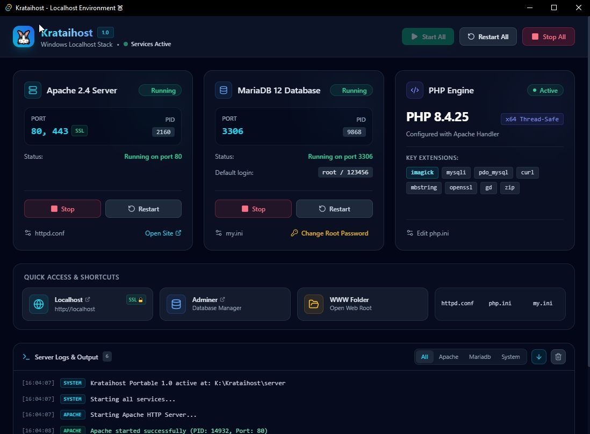

# Krataihost ( Kra-tai means "rabbit" in Thai. )

**A portable localhost stack for Windows: Apache + PHP + MariaDB, with a desktop control panel.**

Unzip it, run it, and start building. No installer, no registry changes, no fixed paths: you can move the folder to another drive or a USB stick and it still works.



## What's inside

| Component | Version |
|---|---|
| Apache HTTP Server | 2.4.68 |
| PHP | 8.4.25 |
| MariaDB | 12.3.3 |
| Adminer (database manager) | 6.0.1 + Fatboy Theme |

## Features

- **Portable:** runs from any folder, including paths with spaces or non-English characters. Move or rename the folder whenever you like.
- **One-click control:** start and stop Apache and MariaDB from the dashboard or the system tray.
- **Port check:** tells you when port 80, 443 or 3306 is already used by another program.
- **Clean shutdown:** Exit from the tray stops MariaDB properly, so your data stays safe.
- **HTTPS ready:** `https://localhost` works with a bundled self-signed certificate.
- **Adminer with Fatboy Theme:** a modern light/dark database manager that works fully offline.
- **Quick access:** open localhost, Adminer, the web root folder, `httpd.conf`, `php.ini` and `my.ini` with one click.

## Requirements

- Windows 10 / 11 (64-bit)
- Microsoft Edge WebView2 Runtime (already built into Windows 11 and up-to-date Windows 10)
- Free ports: 80, 443, 3306

## Download
https://github.com/snagfiles/Krataihost/releases/download/localhost/krataihost_20260928.zip

## Getting started

1. Download the latest `Krataihost-YYYYMMDD.zip` from [Releases](../../releases).
2. Extract it anywhere, for example `D:\Krataihost`.
3. Run `Krataihost.exe`.
4. Click **Start** for Apache and MariaDB.
5. Open http://localhost.

Put your projects in `server\www`.

## Database login

| | |
|---|---|
| Host | `localhost` |
| Port | `3306` |
| Username | `root` |
| Password | `123456` |

Open Adminer at http://localhost/adminer.php.

> ⚠️ Change the root password if your machine is reachable from other computers.

## HTTPS

The certificate is self-signed, so your browser will show a security warning the first time. This is normal for local development. Click **Advanced → Proceed to localhost**.

## Folder layout

```
Krataihost/
├─ Krataihost.exe        Control panel
└─ server/
   ├─ apache/            Apache HTTP Server
   ├─ php/               PHP
   ├─ mariadb/           MariaDB (data lives in mariadb/data)
   └─ www/               Your websites (document root)
```

## Backup / move to another PC

1. Exit Krataihost from the tray icon.
2. Copy or zip the whole `Krataihost` folder.

That's it: all settings and databases live inside the folder.

## FAQ

**Apache won't start.**
Another program is probably using port 80 or 443 (Skype, IIS, XAMPP, WAMP…). Close it or change the port in `httpd.conf`.

**MariaDB won't start.**
Check whether another MySQL/MariaDB service is using port 3306.

**Adminer says "empty password is not allowed".**
Adminer refuses logins with an empty password. Use the default `123456`, or set a password for your user.

## License

Krataihost: MIT License

Bundled third-party software keeps its own license:

- Apache HTTP Server: Apache License 2.0
- PHP: PHP License 3.01
- MariaDB: GPL v2
- Adminer: Apache License 2.0 / GPL v2 (see `server/www/adminer-LICENSE.txt`)
